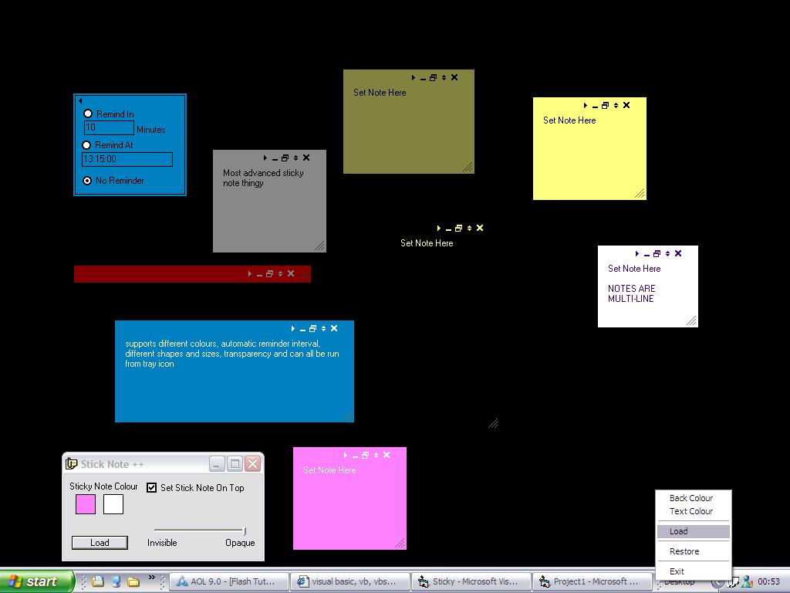



## \[ Advanced Stick Note \+\+  \]

### Description

after seeing many stick note programs here i decided to make my ow more advanced version. it suppots many more options than others and looks visually attractive,notes can be editored at any time, and whole program can be run from tray icon (borrowed tray icon code from psc sorry forgot who). take a look and download please comment and vote
 
### More Info
 

             |
---                |---
**Submitted On**   |2004-06-21 20:08:02
**By**             |[Gareth CodeMan](https://github.com/Planet-Source-Code/PSCIndex/blob/master/ByAuthor/gareth-codeman.md)
**Level**          |Intermediate
**User Rating**    |4.4 (40 globes from 9 users)
**Compatibility**  |VB 3\.0, VB 4\.0 \(16\-bit\), VB 4\.0 \(32\-bit\), VB 5\.0, VB 6\.0
**Category**       |[Complete Applications](https://github.com/Planet-Source-Code/PSCIndex/blob/master/ByCategory/complete-applications__1-27.md)
**World**          |[Visual Basic](https://github.com/Planet-Source-Code/PSCIndex/blob/master/ByWorld/visual-basic.md)
**Archive File**   |[\[\_Advanced1760326212004\.zip](https://github.com/Planet-Source-Code/gareth-codeman-advanced-stick-note__1-54528/archive/master.zip)

